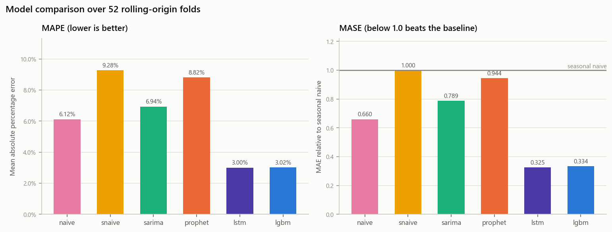
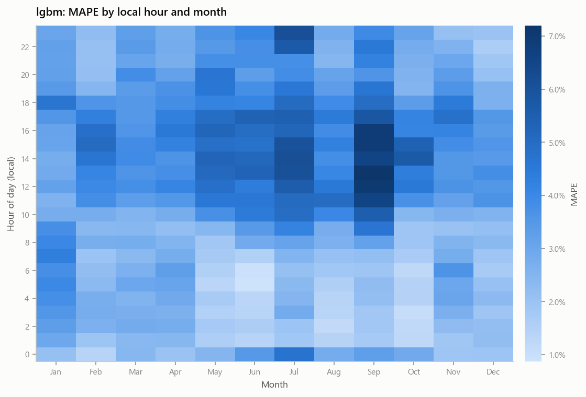
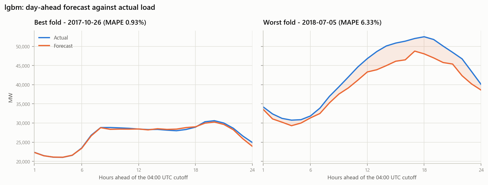
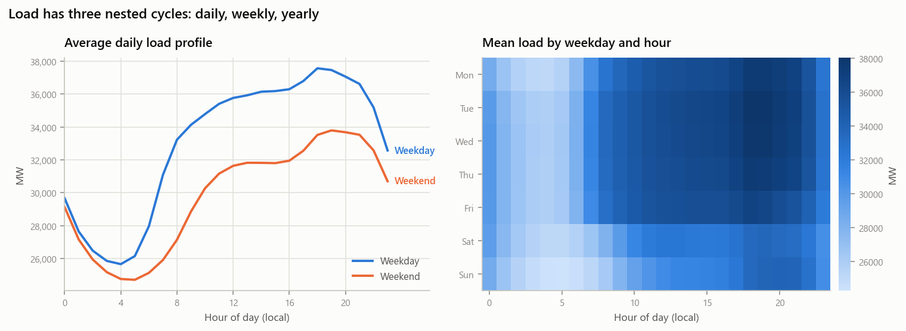
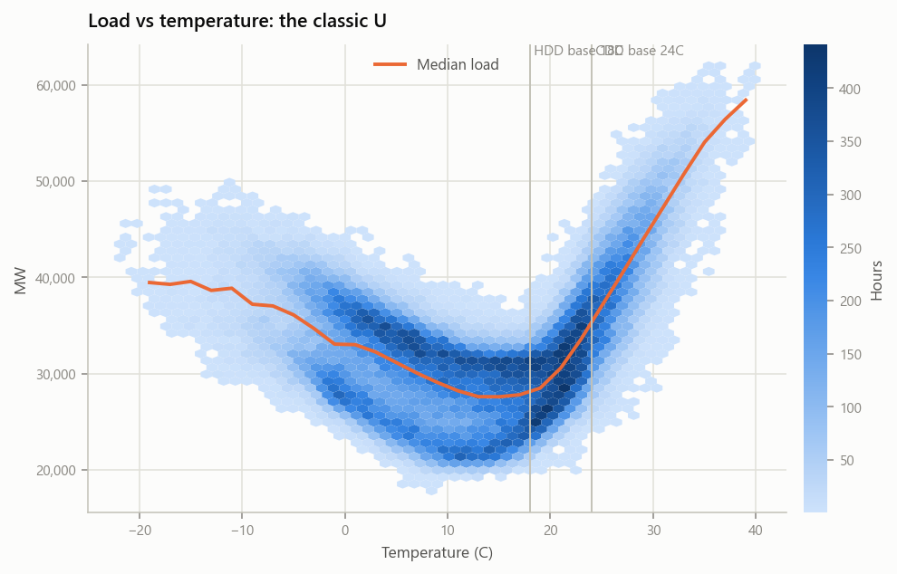
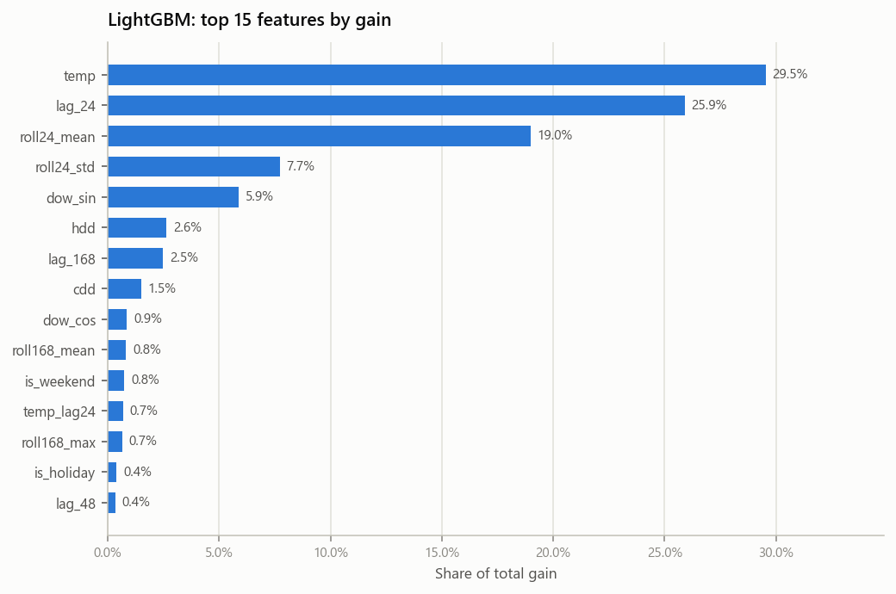

# Day-ahead electricity load forecasting — PJM East

Forecasting the next 24 hours of hourly electricity demand for the PJM East zone
(~145k hourly observations, 2002–2018), and doing it in a way whose numbers survive
scrutiny.

The interesting part of this project is not the model. It is the **backtest**: a
rolling-origin protocol that refits every model from scratch 52 times, scores all of
them on identical target points, and is guarded by a leakage test suite that tries to
break it three different ways.

> **Status:** complete. 118 tests green, CI green, and the model is
> [live on Cloud Run](https://forecast-api-399546784543.us-central1.run.app/docs).
> Every number below is regenerated from the real PJME series by
> `python -m src.report --readme` — none is typed by hand.

---

## The problem

Given everything known up to the end of day *D*, predict the 24 hourly load values of
day *D+1*. Grid operators use this to schedule generation; being wrong in the evening
peak is expensive in a way that being wrong at 4am is not.

## Method

```
Kaggle PJME_hourly.csv ─┐
                        ├─► clean ─► pandera ─► features ─► 5 models ─► rolling-origin backtest ─► report
Open-Meteo temperature ─┘                          │
                                                   └─► full retrain ─► joblib ─► FastAPI ─► Docker ─► Cloud Run
```

### 1. Cleaning — five rules, each one audited

Real grid data is messy in specific, documented ways. Every rule reports how many rows
it touched, so the pass produces a reconciliation table rather than a black box.

| Rule | What it handles |
|---|---|
| 1 | US/Eastern wall clock → UTC. DST fall-back repeats an hour (averaged); spring-forward has an hour that never existed (dropped). |
| 2 | Duplicate stamps merged; index rebuilt on a complete hourly grid. |
| 3 | Gaps ≤ 6h linearly interpolated and flagged; gaps > 6h quarantine the whole local day (`bad_day`), excluded from training *and* scoring. |
| 4 | Outliers winsorized at median ± 5·MAD **within each (month, hour) cell** — a global threshold would flag every normal summer afternoon. |
| 5 | pandera schema: continuous index, load in [10k, 65k] MW, temperature in range, flags binary. |

**The timezone decision, stated once.** Everything downstream runs on a **UTC** grid, and
the "operating day" is 05:00–05:00 UTC (midnight EST). This guarantees the horizon is
always exactly 24 points and `lag_24` is always exactly 24 rows back — neither is true on
a local-time grid, which has a 23-hour and a 25-hour day every year. Calendar features
still read the *true local clock*, because that is what drives human demand.

### 2. Features — and the leakage contract

| Group | Features |
|---|---|
| Lags | `lag_24`, `lag_48`, `lag_168` |
| Rolling (evaluated at the cutoff) | `roll24_mean`, `roll24_std`, `roll168_mean`, `roll168_max` |
| Calendar (local clock) | `hour_sin/cos`, `dow_sin/cos`, `month_sin/cos`, `is_weekend`, `is_holiday` |
| Weather | `temp`, `temp_lag24`, `hdd`, `cdd` |

For a target hour *t* with cutoff *c*, **every feature except the `temp` family reads only
timestamps ≤ c**. `lag_24` is the binding constraint: it touches *c* exactly when *t* is the
last hour of the day, so the boundary is tight rather than comfortably slack.

The `temp` family is deliberately exempt — it uses realised temperature at the target hour,
a **perfect weather forecast** assumption. That is the single largest optimism in these
results and it is stated everywhere they appear.

### 3. Models

| Model | Role | Notes |
|---|---|---|
| `naive` | yesterday, same hour | floor |
| `snaive` | last week, same hour | **the MASE denominator** |
| `sarima` | ARIMA(2,0,2) + Fourier exog | s=168 is intractable; 3 daily + 3 weekly harmonics as exogenous regressors instead |
| `prophet` | additive decomposition | daily/weekly/yearly + US holidays; interpretable structure |
| `lgbm` | **24 direct models, one per lead** | expected best |
| `lstm` | 1-layer encoder + exog head | optional (`torch`); reported honestly either way |

**Direct, not recursive, for LightGBM.** A recursive model feeds its own output back in as
`lag_24`, so errors compound across the horizon *and* it sees true lags in training but
predicted lags in production. Twenty-four independent regressors have no such mismatch:
every horizon is a plain supervised problem on exactly the feature vector it will see live.

Every model implements the same two methods, so the backtest loop contains no per-model
branching — adding a model is adding a file.

```python
class ForecastModel(Protocol):
    name: str
    def fit(self, history: pd.DataFrame) -> None: ...
    def predict(self, horizon_index, future_exog) -> np.ndarray: ...   # length 24
```

### 4. Backtest

```
for each of the last 52 weeks:
    cutoff  = 04:00 UTC on the target day
    train   = everything ≤ cutoff          (expanding window, refit from scratch)
    predict = the next 24 hours
    step back 7 days
```

- **Never a random split.** A random train/test split lets a model train on Tuesday and
  Thursday to predict Wednesday. Every autocorrelated series scores brilliantly that way.
- **Never one fold.** Single-fold results have enormous variance; 52 folds is one year.
- **MASE over MAPE.** MAPE says how wrong; MASE says *whether the model is worth having*.
  Below 1.0 beats "assume this week looks like last week"; at or above 1.0, don't deploy.

One protocol caveat, disclosed rather than buried: a 7-day step lands **every fold on the
same weekday**. That is harmless for the headline comparison (all models see identical
points) but means weekday/weekend breakdowns come from a separate dense run with a 1-day
step. Both are labelled in the report.

---

## Results

<!-- RESULTS:BEGIN — regenerated by `python -m src.report`; do not edit by hand -->

52 rolling-origin folds, 1,248 scored hours per model. Shipped model: **lgbm**.

| model | MAPE | RMSE (MW) | MASE | folds |
|---|---|---|---|---|
| naive | 6.12% | 2,660 | 0.660 | 52 |
| snaive | 9.28% | 3,844 | 1.000 | 52 |
| sarima | 6.94% | 3,356 | 0.789 | 52 |
| prophet | 8.82% | 3,685 | 0.944 | 52 |
| lstm | 3.00% | 1,305 | 0.325 | 52 |
| **lgbm** | 3.02% | 1,413 | 0.334 | 52 |

### Which of those differences are real?

Paired Wilcoxon signed-rank on per-fold MAE — paired because both models
forecast the *same* target points, which removes fold difficulty from the
comparison; signed-rank rather than a t-test because fold errors are
right-skewed by a handful of extreme-weather days.

| model | MAE (MW) | beats seasonal naive? | distinguishable from `lgbm`? |
|---|---|---|---|
| `lstm` | 985 | **yes** (p=0.0000) | **no — statistical tie** (p=0.64) |
| `lgbm` | 1,012 | **yes** (p=0.0000) | — shipped |
| `naive` | 2,000 | **yes** (p=0.0001) | yes, worse (p=0.0000) |
| `sarima` | 2,390 | **no** (p=0.11) | yes, worse (p=0.0000) |
| `prophet` | 2,861 | **no** (p=0.41) | yes, worse (p=0.0000) |
| `snaive` | 3,031 | — *is* the baseline | yes, worse (p=0.0000) |

- `lstm` cannot be distinguished from `lgbm` on this evidence — the raw MAPE ordering between them is not a result.
- `sarima`, `prophet` do **not** beat the seasonal-naive baseline at p<0.05, despite MASE values below 1.0. A MASE of 0.94 over 52 folds is within noise of 1.0.

**What the errors say:**

1. Hardest hour is 15:00 local at 4.66% MAPE, 2.4x the easiest (01:00, 1.94%).
2. Hardest month is Sep at 4.32%, against Dec at 2.56% -- error tracks temperature-driven demand, not calendar position.
3. Day type barely matters: 3.31% weekend vs 3.28% weekday, a 1% relative gap. The calendar features have absorbed the weekly cycle, so weekends are not a distinct weak spot.
4. Grouped figures above come from the `lgbm_dense` run (182 folds, 2-day step, all seven weekdays across one year).

<!-- RESULTS:END -->

### The comparison, and where the error lives



Read MASE, not MAPE: 1.0 is the "no better than last week" line. But note from the
significance table above that `sarima` and `prophet` sit below 1.0 *without*
statistically beating the baseline — MASE alone would have overstated both.



The error is not spread evenly. It concentrates in **summer afternoons** — the
cooling-driven peak, where a degree of temperature error costs the most megawatts.
Overnight hours in shoulder months are nearly free to predict.



The worst fold is the more useful panel: the model tracks the shape but
under-predicts the peak, which is the characteristic failure on extreme days.

### What the EDA settled





The U is why the weather features are two one-sided hinges (`hdd`, `cdd`) rather than
a linear temperature term — a single slope would average the heating and cooling arms
into approximately nothing.



Lags and the rolling weekly mean dominate. That is also the explanation for Prophet's
result: it has no lag term at all, and at a 24-hour horizon the recent level *is* most
of the signal.

Remaining figures — STL decomposition, ACF/PACF, error-by-hour across models — are in
[figures/](figures/). Regenerate everything with `python -m src.report --all --readme`.

---

## Guarding against leakage

`tests/test_no_leakage.py` attacks the question from three independent angles, because a
leaking pipeline looks *excellent* right up until production:

1. **Declared contract** — every feature reports which timestamps it reads; assert they all
   fall at or before the cutoff.
2. **Observed behaviour** — corrupt the series *after* the cutoff, rebuild the features, and
   assert the fold's feature rows are bit-identical. This does not trust the module's own
   account of itself. A companion test corrupts future *weather* and asserts that exactly
   `{temp, hdd, cdd}` move and nothing else — so the exemption cannot silently widen.
3. **Predictive sanity** — permute the training target and assert accuracy collapses. A model
   that stays accurate is reading the answer from somewhere.

```
tests/test_clean.py        18   DST both directions, gap rules, row-count conservation
tests/test_features.py     23   every feature against a hand-computed value
tests/test_no_leakage.py   12   the three angles above
tests/test_backtest.py     20   fold geometry, no overlap, MASE alignment
tests/test_models.py       27   the shared interface, per model
tests/test_api.py          10   24 points, 422s, determinism
```

The suite generates its own PJME-shaped series — including a DST duplicate, a DST hole, a
short gap, a long gap and an outlier spike — so **CI needs no Kaggle credentials and no
downloaded data**.

---

## Serving

**Live:** https://forecast-api-399546784543.us-central1.run.app
([interactive docs](https://forecast-api-399546784543.us-central1.run.app/docs))

```bash
curl -X POST "https://forecast-api-399546784543.us-central1.run.app/forecast" \
  -H "Content-Type: application/json" \
  -d '{"date": "2018-07-01"}'
```

```json
{
  "date": "2018-07-01",
  "model": "lgbm",
  "trained_through": "2018-08-03 04:00:00+00:00",
  "predictions": [{"ts": "2018-07-01T05:00:00+00:00", "mw": 33150.4}, "... 23 more"]
}
```

- The artifact bundles the model **and the clean input series**, so the service calls the
  same `build_features` the backtest used. No second feature implementation means no
  train/serve skew — and that is *verified*, not assumed: the deployed service returns
  predictions identical to the offline model to the last decimal (max deviation
  0.000000 MW across the 24-hour horizon).
- Model and feature table load **once at lifespan startup**, not per request — Cloud Run
  reuses a warm process, so that cost is paid once rather than on every forecast.
- **Measured on the live service:** ~19s cold start after scale-to-zero, then ~120ms per
  request end-to-end (including the round trip to `us-central1`); ~30ms measured against
  the same image locally. `min-instances 0` is the deliberate trade — a demo that costs
  nothing at idle in exchange for a slow first call. A production deployment that cared
  about tail latency would set `min-instances 1` and pay for it.
- The serving image installs `app/requirements-serve.txt` only (no prophet, statsmodels or
  torch): the container ships one model, so it should not carry four frameworks' worth of
  cold start.

---

## Quickstart

```powershell
conda create -n p3 python=3.11 -y
conda activate p3
pip install -r requirements.txt

python data/download.py                 # needs ~/.kaggle/kaggle.json; Open-Meteo needs no key
python -m src.clean                     # -> data/processed/pjme_clean.parquet + audit table
python -m src.features                  # -> data/processed/pjme_features.parquet
python -m src.backtest --models naive,snaive,sarima,prophet,lgbm
python -m src.report --all              # -> figures/ + grouped error tables
python -m src.train_final --model lgbm  # -> app/artifacts/lgbm.joblib

pytest -q                               # 110 tests, no data required
ruff format . ; ruff check .
```

Run the service locally:

```powershell
uvicorn app.main:app --reload --port 8080
docker build -f app/Dockerfile -t forecast-api . ; docker run --rm -p 8080:8080 forecast-api
```

Deploy to Cloud Run. The image is built and tested **locally first**, then pushed —
so what runs in production is the same image that answered a `curl` on your laptop,
not a second build performed in the cloud:

```bash
PROJECT=your-project-id
REGION=us-central1
IMAGE="$REGION-docker.pkg.dev/$PROJECT/forecast/forecast-api:latest"

gcloud services enable run.googleapis.com artifactregistry.googleapis.com --project "$PROJECT"
gcloud artifacts repositories create forecast --repository-format=docker --location="$REGION"
gcloud auth configure-docker "$REGION-docker.pkg.dev"

docker build -f app/Dockerfile -t "$IMAGE" .
docker push "$IMAGE"

gcloud run deploy forecast-api --image "$IMAGE" \
  --region "$REGION" --min-instances 0 --max-instances 1 \
  --memory 1Gi --allow-unauthenticated
```

`min-instances 0` means you pay nothing when idle; `max-instances 1` caps the blast
radius of an unexpected traffic spike.

> If you prefer `--source .`, note that gcloud falls back to `.gitignore` when no
> `.gcloudignore` exists — and `.gitignore` excludes `app/artifacts/*.joblib`, the
> one file the container cannot start without. The build succeeds and the container
> crashes on startup. This repo ships a [.gcloudignore](.gcloudignore) that keeps the
> artifact, so both paths work.

## Layout

```
data/download.py          Kaggle + Open-Meteo, idempotent
src/clean.py              the five cleaning rules + reconciliation table
src/features.py           operating-day arithmetic, features, leakage declarations
src/backtest.py           folds, runner, registry, summary
src/metrics.py            MAPE / RMSE / MASE, grouped errors
src/models/               base.py naive.py sarima.py prophet_m.py lgbm.py lstm.py
src/report.py, viz.py     every figure, one theme
src/train_final.py        full retrain -> serving artifact
app/                      FastAPI service, Dockerfile, serve-only requirements
tests/                    110 tests, synthetic fixtures, no data needed
```

## Licence

MIT. Load data © PJM via Kaggle; temperature via [Open-Meteo](https://open-meteo.com/).
